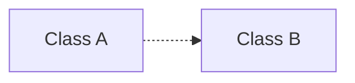
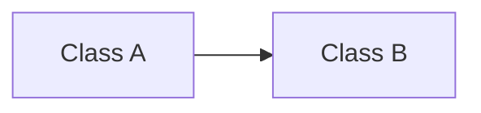

使用设计模式的目标：应对变化，提高复用（二进制级别的复用）

### 模式分类

#### GOF-23的分类：

从目的来看：

1. 创建型（Creational）：将对象的部分创建工作交给其他类或者其他对象，应对需求变化为对象创建时带来的冲击；
2. 结构型（Structural）：通过类继承或对象组合获得灵活的结构，应对需求变化为对象的结构时带来的冲击；
3. 行为型（Behavioral）：通过类继承或对象组合来划分类与对象间的职责，应对需求变化为多个交互的对象时带来的冲击。

从范围来看：

1. 类模式处理类与子类的静态关系；
2. 对象模式处理对象间的动态关系。

#### 李建忠老师的分类：

从封装变化角度对模式分类

1. 组件协作：
   - [Template Method](#TemplateMethod)
   - [Strategy](#Strategy)
   - [Observer/Event](#observer)
2. 单一职责：
   - [Decorator](#Decorator)
   - Bridge
3. 对象创建：
   - Factory Method
   - Abstract Factory
   - Prototype
   - Builder
4. 对象性能：
   - Singleton
   - Flyweight
5. 接口隔离：
   - Facade
   - Proxy
   - Mediator
   - Adapter
6. 状态变化：
   - Memento
   - State
7. 数据结构：
   - Composite
   - Iterator
   - Chain of Responsibility
8. 行为变化：
   - Command
   - Visitor
9. 领域问题：
   - Interpreter

[UML关系类型](#UML)

### Refactoring to Patterns

重构关键技法：

1. 静态绑定 --> 动态绑定
2. 早绑定 --> 晚绑定（早产生的东西调用晚的）
3. 继承 --> 组合
4. 编译时依赖 --> 运行时依赖
5. 紧耦合 --> 松耦合

### 面向对象设计原则

1. 设计原则重于设计模式，掌握了设计原则之后可以产生出自己的设计模式；
2. 设计模式可能会过时，但设计原则不会；
3. 不符合设计原则的设计模式是错误的。

#### 原则 1：依赖倒置原则（DIP）

1. 高层模块（稳定）不应该依赖于低层模块（变化），二者都应该依赖于抽象（稳定）； 
2. 抽象（稳定）不应该依赖于实现细节，实现细节应该依赖于抽象（稳定）。

总结：稳定的不应该依赖于不稳定的东西。通过抽象可以隔离变化。

#### 原则 2：开放封闭原则（OCP）

1. 对扩展开放，对更改封闭；
2. 类模块应该是可扩展的，但是不可修改。

总结：应该使用扩展的方式去应对变化。

#### 原则 3：单一职责原则（SRP）

1. 一个类应该仅有一个引起它变化的原因；
2. 变化的方向隐含着类的责任。

总结：一个类不应该有太多的成员，这意味着它的职责不是唯一的。

#### 原则 4：Liskov替换原则（LSP）

1.  子类必须能够替换它们的基类；
2. 继承表达类型抽象。

总结：父类能够使用的方法，子类也应该都能使用。二者是组合的关系。

#### 原则 5：接口隔离原则（ISP）

1. 不应该强迫客户程序依赖它们不用的方法；
2. 接口应该小而完备。

总结：不应该把不必要的接口暴露出去。子类内部使用的方法应该是private的。

#### 原则 6：优先使用对象组合，而不是类继承

1. 类继承通常为白箱复用，对象组合（Class A中有一个Class B）通常为黑箱复用；
2. 继承在某种程度上破坏了封装性，子类父类耦合度高；
3. 而对象组合则只要求被组合的对象具有良好定义的接口，耦合度低。

总结：不是很多东西有继承的关系。很多时候会误用。

#### 原则 7：封装变化点

1. 使用封装来创建对象之间的分界层，让设计者可以在分界层的一侧进行修改，而不会对另一侧产生不良的影响，从而实现层次间的松耦合。

两类不应做的假设：

1. 所有的部分都是变化的：则任何设计模式都无效；
2. 所有的部分都是稳定的：则不需要实现任何设计模式。

总结：封装更高层次的理解是封装变化点，一侧变化一侧稳定。

#### 原则 8：针对接口编程，而不是针对实现编程

1. 不将变量类型声明为某个特定的具体类，而是声明为某个接口；（不能绝对化）
2. 客户程序无需获知对象的具体类型，只需要知道对象所具有的接口；
3. 减少系统中各部分的依赖关系，从而实现“高内聚，松耦合”的类型设计方案。

总结：和依赖倒置原则（DIP）相辅相成。

#### 深入：接口标准化

> 产业强盛的标志

核心：分工协作，实现复用  

---

### 模式 1： Template Method

`Intention` 存在一个稳定的算法骨架、步骤，在这个骨架中的部分子程序是不稳定的，则此时可以使用Template Method。

`Definition` 在基类中定义一个算法的骨架，将一些步骤延迟到子类中，使得子类可以不改变算法的结构即可重定义该算法的某些特定步骤。

`Hint` 延迟到子类：基类定义虚函数让子类去实现。

`Hint` C++基类的必须写析构函数，并且这个析构函数应该是虚函数。

`Hint` C++中稳定的部分应该写成非虚函数，支持变化的部分应该写成虚函数。

`Conclusion`

1. 非常基础性的设计模式。在面向对象系统中有大量应用。
2. 机制非常简洁（虚函数的多态），为应用程序框架提供了灵活的扩展点，是代码复用方面的基本。
3. 反向控制结构。（库来调用子类）
4. 被Template Method调用的方法可以有实现，也可以没有任何实现（抽象方法、纯虚函数），推荐将其设置为protected方法。

`Practice` [01 Template Method](https://github.com/CaptainXX/Design_Patterns/tree/main/01_template_method)

 

---

### 模式 2：Strategy

`Intention` 存在一系列可能需要扩展或者修改的算法，在某个固定的位置根据不同情况调用不同方法，则可以使用Strategy来解耦这些算法。

`Definition` 定义一系列算法，把它们一个个封装起来，并且使它们可以互相替换。本模式使得算法可独立于使用它的客户而变化。

`Hint` 需要用Strategy的代码特征：有大量的`if else`出现，“if else 散弹”。 

`Hint` 当存在绝对稳定不变的情况时，不应该用Strategy，而是应该用`if else`，例如一周七天每天做什么事。

`Conclusion`

1. Strategy及其子类为组件提供了一系列**可重用的算法**，从而可以使得类型在运行时方便地根据需要在各个算法之间进行切换；
2. Strategy模式提供了用条件判断语句以外的**另一种选择**，消除条件判断语句，就是在解耦合。含有许多条件判断语句的代码通常都需要Strategy模式；
3. 如果Strategy没有实例变量，那么各个上下文可以**共享同一个Strategy对象**，从而节省对象开销。（Singleton）

`Practice` [02 Strategy](https://github.com/CaptainXX/Design_Patterns/tree/main/02_Strategy/02_Strategy)

---

### 模式 3：Observer/Event

`Intention` 定义对象间一对多的关系，当一个对象的状态发生改变时，所有依赖于它的对象都得到通知并被自动更新。

`Definition` 当多个对象之间存在通知依赖关系时，即可使用Observer模式实现他们之间的松耦合。

`Hint` 通知依赖关系：一个对象（目标）的状态发生改变，所有的依赖对象（观察者）都能得到通知。

`Hint` 进度条可以使用Observer模式实现。

`Hint` C++一般不推荐使用多继承，会造成耦合的问题；但是推荐一种多继承的方法，就是只有一个是父类，其他的都是接口。

`Conclusion`

1. 使用面向对象的抽象，Observer模式使得我们可以独立地改变目标与观察者，从而使二者之间的依赖关系达到松耦合；
2. 目标发送通知时，无需指定观察者，通知（可以携带通知信息作为参数）会自动传播；
3. 观察者自己决定是否需要订阅通知，目标对象对此一无所知；
4. Observer模式是基于事件的UI框架中非常常用的设计模式，也是MVC模式的一个重要组成部分。

`Practice` [03 Observer](https://github.com/CaptainXX/Design_Patterns/tree/main/03_Obsever/03_Obsever)

---

### 模式 4：Decorator

`Hint` 组合优于继承；

`Hint` 当需要的子类指针都是同一父类的子类时，则可以将其指针声明为父类指针，可以有效增加复用；

`Hint` 当子类中都有相同成员时，应当把它往上提，上提有两种方法：1. 提到基类中，2. 新增中间类Decorator；

`Hint` 用组合的方式引出多态的使用；

`Hint` Decorator继承父类是为了维护接口的规范，组合父类是为了实现子类的运行时多态。

---

### UML类图的6种关系类型

#### 1. Dependency (依赖)

`Definition` 类A依赖类B，在代码中表现为在类A中临时使用了类B，这种关系具有偶然性、临时性，但类B的变化会对A造成影响，所以称之为依赖关系。

`Behavior` 

1. 类B是类A成员函数的形参；
2. 类A中存在类B的局部变量；
3. 类A通过静态成员使用类B；

#### 2. Association (关联)

`Definition` 类A关联类B，对于两个相对独立的对象，当一个对象的实例与另一个对象的一些特定实例存在固定的对应关系时，这两个对象之间为关联关系。

`Behavior` 

1. 类A中有类B的成员变量；

#### 3. Aggregation (聚合)

`Definition` 类A聚合于类B，表示类A和类B是一种关联关系，同时类A是类B的一部分，语义上和关联相同，体现了整体与部分的关系。但类A和类B是可以分别独立存在的。

`Behavior`

1. 类B中有类A的成员变量，类A是类B的一部分，一般在类A中存在set方法用于设置类B的对象；

#### 4. Composition (组合)

`Definition` 类A由类B组合而成，表示类A和类B的强关联关系，类B是类A的一部分，同样体现了整体与部分的关系，但类A和类B生命周期相同，不能独立存在。

`Behavior`

1. 类A中有类B的成员变量，类A和类B不可分离；

#### 5. Generalization (继承)

`Definition` 类A继承类B的功能和成员，并可以增加自己新功能的能力，效果同C++中的继承。

`Behavior`

1. 类A : public 类B；

#### 6. Implementation (实现)

`Definition` 类A实现类B的接口。

`Behavior` 

1. 类B是含有纯虚函数的抽象类，类A继承类B后实现虚函数；
