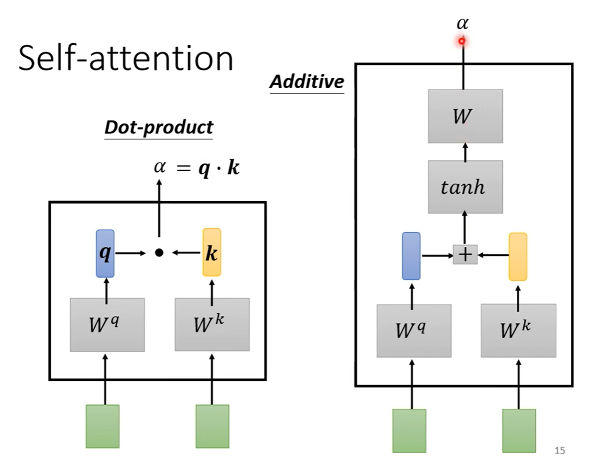

---
layout:	post
title:	Deep Learning
date:   2022-05-21 13:24:00 +0800
categories: note
---

# Deep Learning

> 李宏毅 2022 深度学习课程 https://www.youtube.com/channel/UC2ggjtuuWvxrHHHiaDH1dlQ/playlists

## 1. 模型训练过程

首先检测训练集的Loss，如果Loss较大，则可能有两个原因：

1. 模型出现偏差（Model bias），即能够降低Loss的拟合函数不在模型能够调参获得的范围内，此时需要增加模型的复杂度，增加输入的Feature等；
2. 解优化方法有问题，例如使用梯度下降法进行解优化就有可能使结果卡在局部最优解上；
   - 通过对比来判断，从比较浅的网络或者其它更容易优化的模型开始测试（例如线性回归或支持向量机）
   - 如果更深的网络不能在训练集上获得更小的Loss，则说明存在优化问题

如果训练集Loss较小，测试集Loss较大，则：

1. 出现过拟合：模型只能识别训练集上的数据，对于不存在的数据不能正确的判断
   - 进行数据增强：需要合理进行增强，不能让数据变成不可能的数据，这样网络就会学到错误的经验；
   - 对模型参数进行限制，使用更少的参数或共享参数（CNN）；
   - 使用更少的特征；
   - Early stopping；
   - Regularization；
   - Dropout；
2. Mismatch：训练集和测试集差很多；

Cross Validation：

- 将训练集分为两部分，一部分做训练，一部分做测试

N-fold Cross Validation：

- 将训练集分为N部分，一个部分做测试，其它部分分别做训练，这样根据测试集从第1个部分到第N个部分，就会产生N个测试结果，然后对这N个结果取平均，获得模型的测试结果。例如：分为3份，首先第1，2份进行训练，第3份做测试，得到一个结果；再用第1，3份进行训练，第2份做测试，得到结果；再用第1份做测试，得到结果。对得到的三个结果进行平均，得到最终结果。

### 1.1 梯度下降失效的可能

梯度为0的点（Critical Point）：

1. 局部最小值
2. 马鞍点

如何判断？计算Hessian：

$$
L(\theta) \approx L(\theta^{'}) + \frac{1}{2}(\theta - \theta^{'})^TH(\theta - \theta^{'})
$$

在 $\theta^{'}$周围，令 $v = (\theta - \theta^{'})$ ，对于所有的 $v$ 如果

- $v^THv > 0 \quad \therefore L(\theta) > L(\theta^{'})$：则 $\theta{'}$ 是一个局部最小值，此时H为正定矩阵，特征值全为正；
- $v^THv < 0 \quad \therefore L(\theta) < L(\theta^{'})$：则 $\theta{'}$ 是一个局部最大值，此时H为负定矩阵，特征值全为负；
- 如果有时大于0，有时小于0，则 $\theta{'}$ 是一个马鞍点，此时H的特征值有正有负；

在马鞍点上：沿着Hessian的负的特征值（如果想要取最小值）对应的特征向量的方向对参数进行更新，即可得到更小Loss的参数。

上图中*Minimum ratio*表示为正的特征值数量和全部特征值数量的比值，如果全部特征值都是正的，就表示达到了最小值，可以看出实际上能达到局部最小值的时刻并不多。

### 1.2 利用Batch帮助训练

把训练数据分为N个Batch，在每个Batch训练结束后更新梯度和网络参数。

#### 1.2.1 小Batch VS 大Batch

- 小的Batch Size在每次更新时Noise更大，但单次的计算量较少；大的Batch Size在每次更新时更为稳定，但需要的计算量更大；
- 在当前的并行计算中，实际上小的Batch Size和大的Batch Size相比，计算时间增加并不大（V100 MNIST训练时：1~1000计算时间几乎相同，>10000后时间显著增加）；
- 完整跑完一个epoch的时间，小的Batch Size反而比大的Batch Size花费更多；
- 小的Batch Size能获得更好的训练效果（不同Batch的Loss Function略有不同，可能一个Batch的鞍点或局部最小值和另一个Batch不同，就能让梯度继续优化下去）；
- 小的Batch Size能在测试时，获得比 训练时训练到相同准确度的大的Batch Size 的网络更好的结果；（一种解释：小的Batch Size更有可能跳出一Sharp Local Minima）

### 1.3 利用Momentum帮助训练

让每次参数更新时不仅仅考虑梯度下降的方向，而是同时考虑梯度方向和上次更新的方向，或者说考虑过去所有梯度的总和。（物理世界的动量，小球从坡上下滑时，只要有动量存在，就不会卡在鞍点，甚至能够越过Local Minima）

### 1.4 Adaptive Learning Rate

- Training stuck != Small Gradient

- 走到Critical Point就是一件困难的事情

根据梯度调整Learning Rate，梯度大的地方，Learning Rate较小，梯度小的地方，Learning Rate变大。

#### 1.4.1 Adagrad

用历史梯度的均方根值调整Learning Rate。

#### 1.4.2 RMSProp

当$\alpha$较小时，能够更快地使用最新的梯度来修改Learning Rate，相比Adagrad反应更快。

当前常用的Optimizer：

- Adam: RMSProp（考虑更新的步幅） + Momentum（考虑更新方向）

#### 1.4.3 Learning Rate Scheduling

随着训练的步数，调整Learning Rate。

- Learning Rate Decay: 随着训练进行，逐渐减小Learning Rate；
- Warm Up: 开始时LR较小并逐渐增加，在读到一定样本后开始下降；

## 2. 卷积神经网络

根据图像识别任务的需求，添加一些对全连接神经网络的限制，有效地减少了模型的参数，减少了模型过拟合的可能性。

Convolutional Layer = Receptive Field + Parameter Sharing

解释2：用每一个大小为NxNxChannels的Filter以一定的Stride对整张图片的每一个NxN方格进行内积，就得到了一个新的Feature Map；

CNN = （Convolutional Layer + Max Pooling）x N + Feature Flatten + MLP + Softmax

### 2.1 为什么使用了验证集还是会出现过拟合?

验证集选择模型的过程也可以看作是训练，如果需要选择的模型太多，验证集也会变差，产生过拟合。

### 2.2 Deep Network为什么好？

Deep Network比Shallow Network更高效，拟合同样复杂度的函数，需要的参数量有指数级差距。深度网络更不容易过拟合。

### 2.3 Spatial Transformer Layer

- 通过全连接网络元素的权重设计，就可以实现旋转、平移和缩放（例如把要进行transform的权重设为1，其它设为0）

- 通过插值，将浮点数的坐标更新到新的输出；

## 3. Self-Attention

不同的计算SA的方式：

## 16. RNN(Recurrent Neural Network)

Slot Filling：将读取的一段话中的信息提取出来并填入表中；

FFN无法分辨一个地名是出发地还是目的地，需要有记忆力的网络来进行；

### 16.1. Elman Network

### 16.2. Jordan Network

将网络的输出存储起来，在下一次使用。

### 16.3 Bidirectional RNN

双向扫描句子，当看到某个单词时，相当于网络已经看完了整个句子；

### 16.4 Long Short-term Memory(LSTM)

Standard RNN：目前的RNN基本都是LSTM。

## References

1. [A Recipe for Training Neural Networks](http://karpathy.github.io/2019/04/25/recipe/)
